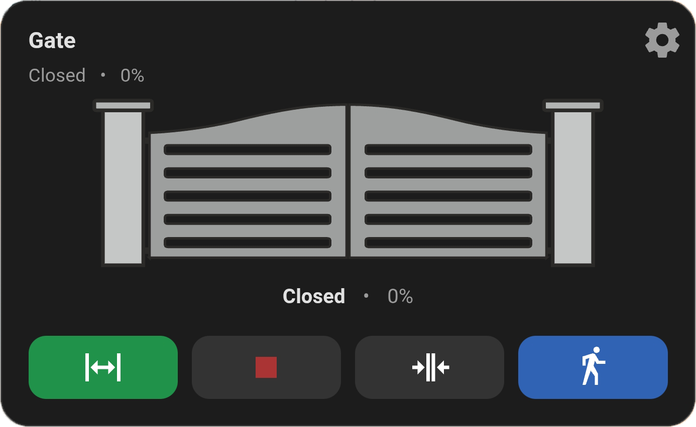
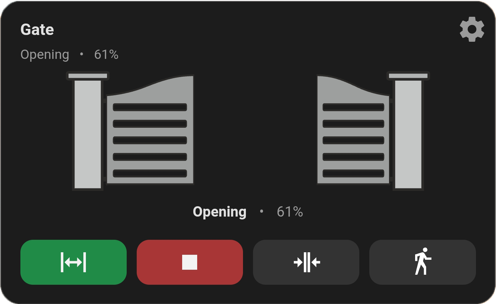
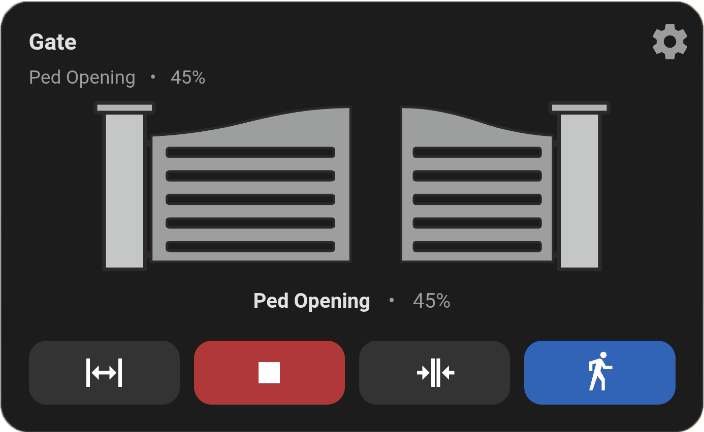
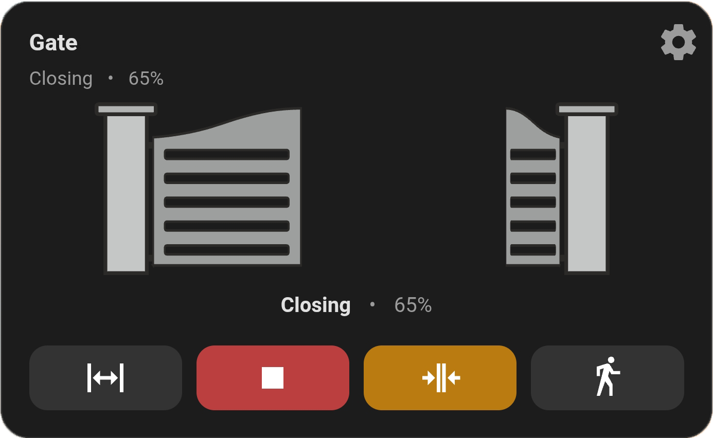
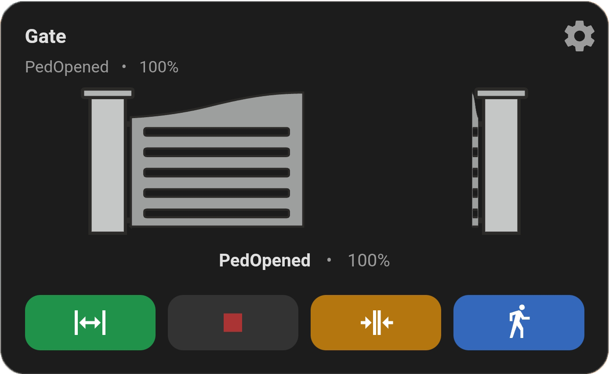
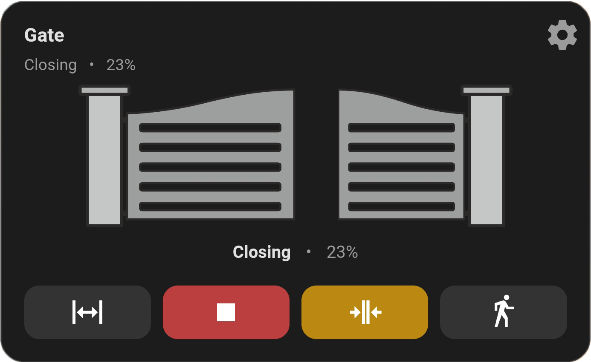
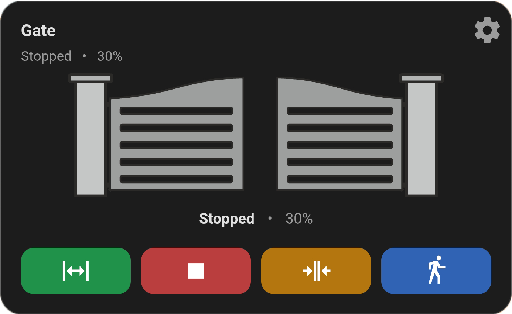
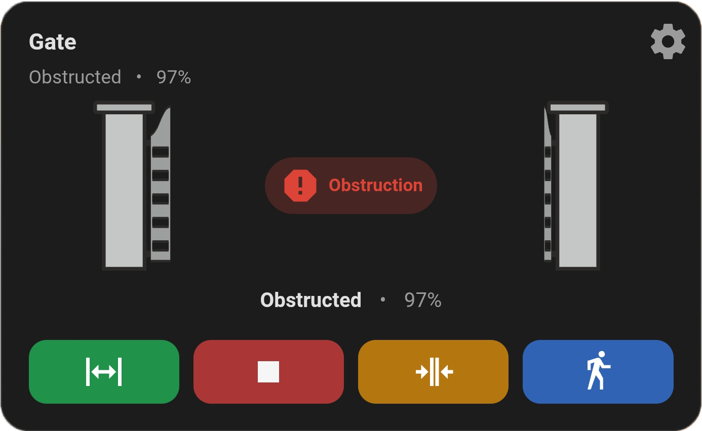
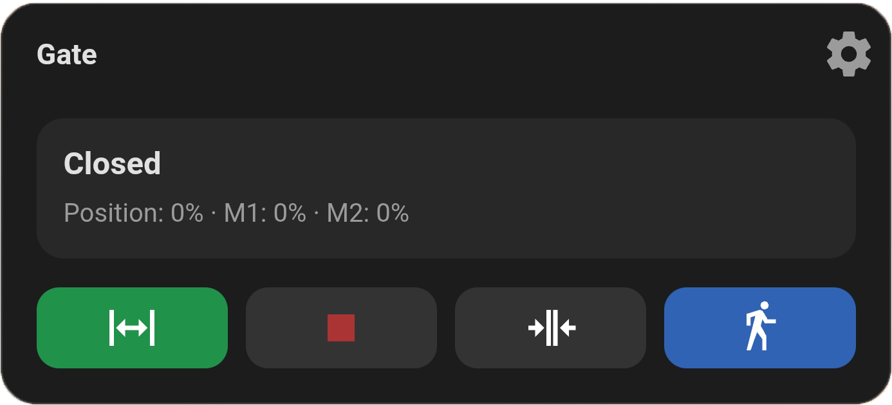

# CB19 ESPHome Card 🚀

[](https://hacs.xyz)
[](https://github.com/szokezoltan95/CB19-esphome-card/releases)


A clean, compact and highly configurable Home Assistant Lovelace card for visualizing and controlling a dual-wing gate driven by a custom CB19 ESPHome firmware.

---

## ⚠️ Compatibility

This card works **ONLY** with:

👉 https://github.com/szokezoltan95/CB19-esphome  

It depends on custom entities (motor positions, states, etc.).

❌ Not compatible with:
- stock CB19 controllers  
- generic ESPHome configs  

---

## ✨ Key Features

- Smooth dual-wing animation (Motor1 + Motor2)
- Fully configurable UI from dashboard YAML
- Active action highlighting (with animation)
- Available action indication
- Pedestrian mode support
- Warning overlays (photocell / obstruction)
- Minimal height, tablet-friendly design
- Graphic / text / hybrid display modes

---

## 📸 Screenshots

| Closed | Opening | PedOpening |
|--------|--------|------------|
|  |  |  |

| Closing | PedOpened | PedClosing |
|--------|-----------|------------|
|  |  |  |

| Stopped | Obstruction | Minimal layout |
|--------|-------------|---------|
|  |  |  |


---

## 📦 Installation

### HACS

1. HACS → Frontend  
2. Add custom repo:  
   https://github.com/szokezoltan95/CB19-esphome-card  
3. Category: Dashboard  
4. Install  
5. Reload Home Assistant  

---

### Manual

Copy:

```
dist/cb19-esphome-card.js
```

to:

```
/config/www/
```

Add resource:

```yaml
lovelace:
  resources:
    - url: /local/cb19-esphome-card.js
      type: module
```

---

## 🧩 Basic Usage

```yaml
type: custom:cb19-esphome-card
controller: cb19_gate
```

---

## ⚙️ Configuration Overview

### 🔧 Core

| Option | Description |
|-------|------------|
| controller | ESPHome entity prefix |
| motor1_side | Which side is Motor1 (`left` / `right`) |

---

### 🖼️ Layout

| Option | Values | Description |
|-------|--------|------------|
| ui.view_mode | graphic / text / hybrid | Display style |
| ui.header.enabled | true/false | Show header |
| ui.header.title | string | Title text |
| ui.header.show_state | true/false | Show state |
| ui.header.show_position | true/false | Show % |
| ui.header.settings_button_position | header / graphic / none | Button position |

---

### 🎮 Controls

| Option | Description |
|-------|------------|
| ui.controls.enabled | Show buttons |
| show_open | Show open button |
| show_stop | Show stop button |
| show_close | Show close button |
| show_pedestrian | `auto / true / false` |
| available_action_tint | Highlight allowed actions |

---

### 🎨 Icons

| Option | Description |
|-------|------------|
| ui.icons.open | Open icon |
| ui.icons.stop | Stop icon |
| ui.icons.close | Close icon |
| ui.icons.pedestrian | Pedestrian icon |

---

### 🎨 Colors

| Option | Description |
|-------|------------|
| ui.colors.button_default.open | Button background (idle) |
| ui.colors.button_default.stop | Button background (idle) |
| ui.colors.button_default.close | Button background (idle) |
| ui.colors.button_default.pedestrian | Button background (idle) |
| ui.colors.button_active.open | Button background (active action) |
| ui.colors.button_active.stop | Button background (active action) |
| ui.colors.button_active.close | Button background (active action) |
| ui.colors.button_active.pedestrian | Button background (active action) |
| ui.colors.button_available.open | Button background (available action) |
| ui.colors.button_available.stop | Button background (available action) |
| ui.colors.button_available.close | Button background (available action) |
| ui.colors.button_available.pedestrian | Button background (available action) |
| ui.colors.icon_default.open | Icon color (idle) |
| ui.colors.icon_default.stop | Icon color (idle) |
| ui.colors.icon_default.close | Icon color (idle) |
| ui.colors.icon_default.pedestrian | Icon color (idle) |
| ui.colors.icon_active.open | Icon color (active action) |
| ui.colors.icon_active.stop | Icon color (active action) |
| ui.colors.icon_active.close | Icon color (active action) |
| ui.colors.icon_active.pedestrian | Icon color (active action) |
| ui.colors.icon_available.open | Icon color (available action) |
| ui.colors.icon_available.stop | Icon color (available action) |
| ui.colors.icon_available.close | Icon color (available action) |
| ui.colors.icon_available.pedestrian | Icon color (available action) |

### ✨ Effects

| Value | Description |
|------|------------|
| none | No animation |
| pulse | Smooth pulsing |
| blink | Blinking |
| glow | Glow effect |

---

### 📏 Spacing

| Option | Description |
|-------|------------|
| padding.card | Outer padding |
| padding.visual | Gate graphic padding |
| padding.controls_top | Gap above buttons |
| padding.header_bottom | Gap under header |
| padding.content_gap | Internal spacing |

---

## ⚙️ Full Example

```yaml
type: custom:cb19-esphome-card
controller: cb19_gate
motor1_side: left

settings_action: device_page
settings_path: /config/devices/device/XXXX

ui:
  view_mode: hybrid

  header:
    enabled: true
    title: Main Gate
    show_state: true
    show_position: true
    settings_button_position: header

  controls:
    enabled: true
    show_open: true
    show_stop: true
    show_close: true
    show_pedestrian: auto
    available_action_tint: true

  icons:
    open: mdi:arrow-expand-horizontal
    stop: mdi:stop
    close: mdi:arrow-collapse-horizontal
    pedestrian: mdi:walk

  effects:
    active_action: pulse
```

---

## ⚙️ Settings Button

To link device page:

1. Settings → Devices  
2. ESPHome → your device  
3. Copy URL  

---

## 🎯 Design Goals

- Minimal vertical space  
- Clean, readable UI  
- State-driven behavior  
- High configurability without clutter  

---

## 📄 License

MIT
